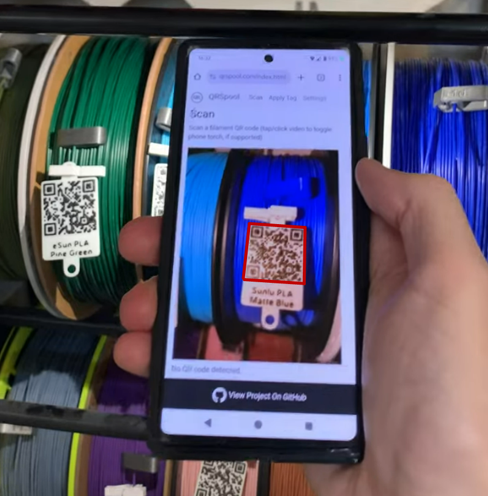
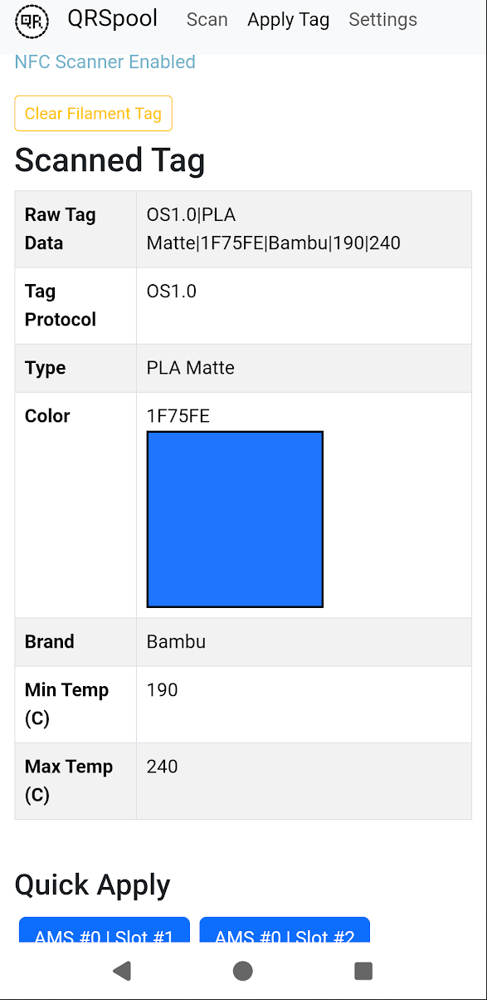

<div align="center">

# QRSpool


</div>

Change your printer's multi-spool filament settings by scanning custom QR codes or NFC tags with your smartphone. Also supports [OpenSpool](https://openspool.io/) and [OpenTag3D](https://opentag3d.info/) NFC tags in Chrome on Android. [Quick demo video here.](https://www.youtube.com/watch?v=UtbaKgVyuF8). 

**This project is in Beta. It's fully functional for printers that use the old LAN mode (not the new LAN+Developer mode), but please report any issues or bugs you encounter since I can't test every compatible printer or filament setting.**

## User Experience

Here's a quick walkthrough of things you can use this project to do once you have everything setup:

You open a website on your phone. The website accesses your phone camera and scans the video feed in real-time for QR codes. Processessing the video feed is handled 100% locally in your broswer, no data is sent to the website server. 



If you scan a QR code that represents a filament, the webpage changes and shows you information about the scanned filament tag and a list of available filament slots on your printer. You can then apply that filament to any slot with the press of a button. 



Or, instead of manually selecting a slot, you can scan another QR code that represents a specific printer slot, and the filament will be applied to it immediately. 

Instead of using printed QR codes, you can also write the filament or slot data to a cheap NFC NTAG tag using a special URL. Then you can tap the tag with your NFC-enabled phone (from any screen, no need to have the broswer open) to open the website and have the data instantly loaded as if you had scanned a QR code. 

If you are using Chrome on an Android phone, you can also use that browser to scan NTAG NFC tags that have the same text data as a QR code, without needing to rely on a special URL format. 

## Getting Started

This project consists of two mostly-decoupled components: 
- A static website ("frontend") that uses client-side Javascript to access your webcam/camera, scan and parse QR codes and NFC tags to extract filament information, and provide a visual interface for applying scanned filament data to a slot on your multi-spool printer. An instance of this frontend, built directly from this repo and hosted on GitHub Pages, is available for free here: https://qrspool.com
- A local API server ("backend") that acts as a communication bridge between your printer and browser, translating between standard REST API requests and whatever protocol your printer uses. You will need to run your own copy of the backend server on the same local network your printer is connected to. 

<div align="center">


</div>

Currently I have implemented a Python (Flask) backend server that will communicate with Bambu Labs printers in LAN-only mode (LAN+Developer mode on newer printers/firmware is not yet supported) using the [bambulabs-api library](https://pypi.org/project/bambulabs-api/). Other servers could be written to support other printer brands without needing to change the frontend code. If you write such a server let me know so I can link to it. 

### Requirements
- A Bambu Labs printer in LAN-only mode (LAN+Developer mode on newer printers/firmware is not yet supported); other brands may be supported in the future
- A server (always-on computer) with a static IP or reliable DNS name on the same LAN as the printer
    - Needs to be able to run either Docker or Python 3 (tested with >=3.10.12)
- A smartphone with camera, or a computer with a webcam (a USB webcam with long cable is best)
    - A modern web browser; Chrome is recommended, but Firefox and Safari also support the core features

### Backend Server Setup
The backend server code is in the `bambu-server` folder. Configuration files are in the `configs` subfolder there. 

First, copy or rename the `bambu_config.example.py` file to `bambu_config.py` and modify it with your printer settings and desired backend server access credentials. You can leave the credentials empty, but the server will still expect you to supply an empty username and password to access it (authentication can't be disabled). 

Docker is the recommended way to run the server. The provided `Dockerfile` supports running the server either over HTTP or HTTPS, just uncomment the appropriate `CMD` line. Then from that folder run:
```bash
sudo docker compose up --build -d
```

HTTP vs HTTPS options: 
- (Default, easiest) HTTPS with a self-signed cert, exposed directly to your LAN. Optionally obtain a real certificate and use that instead. 
- (Recommended, more complex) HTTP, using a reverse proxy to add proper SSL/TLS, and expose that to your LAN. Reverse proxy setup instructions are outside the scope of this project, but [Caddy](https://caddyserver.com/) is a propular free solution that I personally like. 
- (Not recommended) HTTP only.

> [!WARNING]
> If you expose a HTTP-only server to your network then any other devices on your network will be able to passively sniff your server credentials when you use the frontend. 

> [!WARNING]
> The frontend and backend servers MUST be accessed using the same protocol, HTTP or HTTPS. If you mix protocols your broswer will proabably silently refuse to communicate with the backend server. 

Docker will expose the API server on port 5123, but that can be customized by editing the provided docker files. The files in the `configs` subdirectory will be mounted into the container so they will persist across container restarts. 

Want to run it natively instead of through Docker? Setup your config files and then run something like this:
```bash
python3 -m pip install -r requirements.txt
openssl req -new -x509 -keyout key.pem -out server.pem -days 3650 -nodes
flask run --host=0.0.0.0 --cert=cert.pem --key=key.pem
```

### Frontend Usage
Navigate to https://qrspool.com/settings.html on your smartphone using Chrome. 

> [!TIP]
> Firefox and Safari browsers will also work but have limited extra feature support; for example, Firefox doesn't support turning on the phone torch (LED) and Safari doesn't support vibrate on scan, and neither support NFC scanning. Other limitations may exist as well. 

Fill out the URL and username+password for your backend server, save it, and validate it. You only need to do this once, unless your settings/network change.

> [!IMPORTANT]
> If the backend server uses HTTPS with a self-signed certificate you may need to navigate to it each time your broswer re-starts to accept the security risk; otherwise your broswer will silently refuse to communicate with the backend server. For best results use a real certificate for a domain you control, such as a free [DuckDNS](https://www.duckdns.org/) subdomain. 

Go to the Scan tab and grant access to your camera. If prompted, also grant access to NFC scanning (if desired), and to access devices on your local network (may be needed for communication with your locally-hosted backend server).

The frontend supports scaning QR codes that represent Filaments and Slots (data formats described in the next section). Scanning both types of tags (in either order) will automatically apply the scanned filament to the scanned slot without needing to manually select it on the Apply page. If you'd prefer to confirm before applying, there's a setting for that (and other related features) on the Settings page.

Scanning a Slot tag is optional; you can also just scan a filament tag and then use the Apply page to manually select a slot to apply it to. 

### Optional: Frontend Local Hosting
Use any webserver of your choice to host the `client` folder. For example, `python3 -m http.server` provides a quick and easy development server for testing. There is also a python script in that folder for running a development HTTPS webserver. 

If you want fully-offline local hosting, you'll need to download the `Bootstrap` (CSS and Javascript) and `jsQR` files referenced in each HTML file and modify those references to point to the downloaded files. 

## QR Code Data Format
### Filament Tags
This project supports filament QR codes with the following data format:
```
OS1.0|TYPE|COLOR_HEX|BRAND|MIN_TEMP|MAX_TEMP
```

`OS1.0` is a static string that helps the scanner identify valid QR codes matching this format so it doesn't waste time trying to process unrelated codes. 

The remaining fields, separated by the pipe (`|`) character, should be replaced with data related to the filament you want it to represent. They are approximately in order of importance/necessity for configuring a filament slot. The scanner will parse as many fields as are provided, allowing you to skip values (leave them empty, or ommit them from the end) that you don't care about or that your printer doesn't support setting. 

### Slot Tags
Printer (AMS) slot QR codes use the following format:
```
SLOT|IDS
```

`SLOT` is a static string, like `OS1.0` above. `IDS` is a text string (typically JSON) that identifies the target printer slot. For Bambu printers with an AMS, this looks like:
```
SLOT|{"amsID":0,"slotID":0}
```

The `ids` values for your slots are shown in the "↓ Show/Hide All Slot Info ↓" section of each slot on the Apply page. You can click/tap on it to copy it. 

> [!IMPORTANT]
> Bambu AMS slot IDs seem to be zero-indexed, and the external spool has its own unique numbering. For best results just copy the `ids` value shown in the slot info rather than trying to guess the internal values for a specific slot. They could also change at any time with firmware updates or adding/removing AMS units. 

### Printing QR Codes
I recommend [QR2STL](https://printer.tools/qrcode2stl) for generating printable QR codes (I have a forked copy [here](https://github.com/Aptimex/qrcode2stl) that you can easily self-host, with the delay-for-showing-ads functionality removed). It provides a lot of customization options (notably including different error correction levels) and a quick 3D preview of the STL.

I've had good luck generating QR codes with this data format that are 30x30mm, printed with a 0.4mm nozzle. Smaller QR codes may be difficult to print with enough detail to be decoded reliably unless you switch to a 0.2mm nozzle. [Here's an example](https://printer.tools/qrcode2stl/#shareQR-eyJlcnJvckNvcnJlY3Rpb25MZXZlbCI6IkwiLCJ0ZXh0IjoiT1MxLjB8UExBIE1hdHRlfDFFODQ0MHxCYW1idXwxOTB8MjQwIiwiYmFzZSI6eyJ3aWR0aCI6MzAsImhlaWdodCI6MzAsImRlcHRoIjoxLCJjb3JuZXJSYWRpdXMiOjIsImhhc0JvcmRlciI6ZmFsc2UsImhhc1RleHQiOnRydWUsInRleHRNYXJnaW4iOjEuMiwidGV4dFNpemUiOjMsInRleHRNZXNzYWdlIjoiQmFtYnUgUExBXG5NYXR0ZSBHcmVlbiIsInRleHREZXB0aCI6MC40LCJoYXNLZXljaGFpbkF0dGFjaG1lbnQiOnRydWUsImtleWNoYWluUGxhY2VtZW50IjoidG9wIiwia2V5Y2hhaW5Ib2xlRGlhbWV0ZXIiOjV9LCJjb2RlIjp7ImRlcHRoIjowLjQsIm1hcmdpbiI6MS4yfX0=) of some good starting settings for generating your own QR codes. 

When printing, use the Arachne wall generation method for best results. 

### Attaching QR Codes to Spools
I designed a custom clip that provides multiple options for attaching printed QR codes to filament spools for use with this project, [available here.](https://makerworld.com/en/models/1408538-filament-clip-for-qrspool-tags) It will work with models generated using QR2STL that have a 5mm "keychain" hole. 

### Bambu Printers Caveats
Currently only the official filament profile names (Brand + Type, displayed in the Filament dropdown in Bambu Studio) are supported. Bambu uses static internal identifiers for each available profile that have to be mapped to the human-readable data supplied in a QR code. For example, you must specify `Bambu` as the Brand and `PLA Matte` as the Type in a QR code, with that exact spelling and case, in order for the server to identify the internal code (`GFA01`) assigned to that profile. The server combines the two fields (inserting a space in between them) and looks for a match in the `bambu-ams-codes.json` file to find the correct code to send to the printer. 

If a code match cannot be found, the server will replace the Brand with `Generic` and attempt to find a match again. 

If that fails, the server will check to see if the Type field contains a known filament code (in the `bambu-ams-codes.json` file) and use that directly. 

Alternatively, if the `BRAND` field contains the string `RAWCODE` then the server will just assume that the `TYPE` field contains a custom filament code and use it directly. This allows you to use [custom filament profile saved to your AMS](https://forum.bambulab.com/t/how-to-add-custom-filaments-so-you-can-select-them-in-the-ams/52140) without having to edit the JSON code file. However, I recommend just editing the JSON code file instead since that will be a lot easier to update than printed QR codes if you ever have to reset your AMS or get a new one or something. 

> [!NOTE]
> In my own testing the printer/AMS just silently ignored requests that contained unrecognized codes. So this *should* be safe to play around with, but you ultimately do so at your own risk. 

If all those tests fail to identify an appropriate code, the server will return an error. 

From my testing Bambu printers seem to ignore any temperature values you specify and just use the ones in the profile settings associated with the code; only the filament code and color seem to matter. So you can completely ommit the temperature fields in your QR codes if you want. 

Currently the server will only return information about AMS slots that have filament loaded into them (plus the external spool). This means if you load the Apply page in the middle of changing out a spool you won't be able to apply a scanned code to that slot until you actually insert the filament into the inlet. 

## Using NFC Tags
The Chrome browser on Android has support for reading NFC tags if your phone has NFC hardware (most do). While using a supported broswer the Scan and Apply pages will present a button at the top to enable NFC, which will prompt the browser to ask you for permission to enable that feature. Once enabled you can scan [OpenSpool](https://openspool.io/rfid.html#protocol) or [OpenTag3D](https://opentag3d.info/spec) NFC tags to get filament data that you can then apply, just like scanning QR codes with your phone. Alternatively, you can create NFC tags that contain the same text data as the QR codes. 

For iOS users, see the Using URL Parameters section below for an option that should work on iPhones. 

Currently this project doesn't support writing NFC tags through the website. I recommend using the [OpenTag3D site's Make tab](https://opentag3d.info/make) to easily write tags for Android users. For a more generic method, [NFC Tools](https://play.google.com/store/apps/details?id=com.wakdev.wdnfc) or [NFC TagWriter](https://play.google.com/store/apps/details?id=com.nxp.nfc.tagwriter) apps can be used to write custom data to tags. Similar apps may be available for iOS.

### Using URL Parameters
You can pass filament data to the scan page (the website root) using URL parameters. It accepts the following formats (and checks for them in this order):
- `?qrstring=X`, where `X` is the same data string that you would write to a QR code. 
- `?osjson=X`, where `X` is the JSON string that you would write to an OpenSpook NFC tag (with no line breaks). 
- The 6 OpenSpool filament data keys as individual parameters. For example, `?type=A&color_hex=B&brand=C&min_temp=D&max_temp=E`. The presence of the `type` key is required to trigger processing this format. 
- `?slotstring=X`, where `X` is the same data string that you would write to a slot QR code (e.g. `SLOT|{"amsID":0,"slotID":1}`). This stores the slot as the active slot tag, equivalent to scanning a slot QR code with the camera.

This allows you to create NFC tags with URL targets, which most modern smartphones will process natively without the need to have a specific app open. For example, you could create a NFC tag containing a link like this: 
```
https://qrspool.com?qrstring=OS1.0|PLA|123456|Bambu|190|230
```
When you tap that tag with your phone it should immediately open that link in a browser (probably asking you for confirmation first), parse the tag data in the URL, and take you to the Apply screen with the new tag data ready to apply. 

If you want to, you can also combine a filament parameter with a slot parameter in the same URL to pre-load both at once:
```
https://qrspool.com?qrstring=OS1.0|PLA|123456|Bambu|190|230&slotstring=SLOT|{"amsID":0,"slotID":1}
```

> [!TIP]
> You can set multiple NDEF records in a NFC tag. Most smartphones will natively only try to process the first record, but most dedicated readers (including qrspool.com) will try to process all records. You can set the first record to be a URL link and the second record to be a text record (with OpenSpool JSON or a QR data string) for maximum compatibility. 

### OpenTag3D Field Length Limits
The OpenTag3D spec limits the Material Name (type) field to 5 characters and the Modifier field to 5 characters. Many Bambu filament names exceed these limits. When creating OpenTag3D tags you have several options when a value doesn't fit:

1. For most filament Names and Modifiers, you can just truncate it to 5 characters. However, if the server detects the truncation matches more than 1 possible expansion, it will return an error. 
2. Use a recognized abbreviation. The server knows common abbreviations for longer terms. For example, `Supp` expands to `Support`, `HiSpd` to `High Speed`, and `Tgh+` to `Tough+`. See `bambu-server/configs/type-abbreviations.json` and `modifier-abbreviations.json` for the full list. You can also add your own to these files on your server, or submit a PR to add more to this repo. 
3. Put the full Name and/or Modifier string in the optioanl Color Name field and leave their dedicated fields blank. The server will make a best-effort attempt to match the missing fields from the longer Color Name field.
4. Specify `RAWCODE` for the filament Name and put the appropraite code from the `bambu-server/configs/bambu-ams-codes.json` file in the Type field. 

# Technical Notes
This section provides implementation details about the project architecture for anyone who wants to create an interoperable server or client. Most users can stop reading here. 

## QR Codes

This project uses the [OpenSpool protocol data format](https://openspool.io/rfid.html), modified for minimal size to allow the QR Code to be as small and compact as possible. OpenSpool 1.0 defines a JSON format with 6 values:
- protocol 
- version 
- type 
- color_hex 
- brand
- min_temp
- max_temp

These values have been converted into the string format described above, which can be stored much more compactly in a QR code than JSON data.

## Backend Server Endpoints
The frontend (web client) is responsible for parsing QR codes, extracting filament data from them, and sending that data in a specific format to a separate server that handles passing it off to your printer. Since different printer brands have different APIs, this modular separation makes developing servers that can interact with different printers much easier since the frontend code can (theoretically) be re-used without any changes. 

Unless otherwise stated, data in `<>` brackets should be replaced with an appropriate string, while everything else is a string literal. 

The server should expose the following API endpoints:

###  /serverStatus
This should accept unauthenticated GET requests and return this JSON-formatted response indicating that the server is up and running (regardless of printer status), plus information about server authentication requirements: 
```json
{
    "status": "running",
    "authRequired": "<true|false>",
    "authCorrect": "<true|false>"
}
```

`authRequired` indicates whether requests to all other endpoints require/enforce Basic Auth. `authCorrect` indicates whether the Basic Auth credentials provided in the request (if any; they're optional for this endpoint) are correct. 

This is the endpoint that gets hit when the user validates the server information they saved in the frontend. 

### /printerStatus
This should accept GET requests and return this JSON response, where `<statusMessage>` is some status message obtained from the printer, or a message indicating a communication error between the server and printer: 
```json
{
    "status": "<statusMessage>"
}
```

### /slots
This should accept GET requests and return JSON data about the printer's available filament slots. In particular, it should provide everything the frontend needs to help the user generate a request to the `setFilament` endpoint using the data from a QR code. 

This endpoint should return data with this JSON format:
```json
{
    "slots": [
        {
            "ids": {
                "<OPAQUE>": "<OPAQUE>"
            },
            "displayID": "<value>",
            "<dk1>": "<value>",
            "<dk2>": "<value>",
            "<dk3>": "<value>",
            "<otherKey>": "<value>",
        },
    ],
    "displayKeys": ["<dk1>", "<dk2>", "<dk3>"],
    "colorHexKeys": ["<dk3>"]
}
```
- `slots` is a list of `slot` objects representing filament slots available on the printer. The `ids` and `displayID` keys are mandatory, the rest are optional. 
- `ids` is an opaque object with data that uniquely identifies the slot on this printer. The frontend supplies this exact object back to the server to identify this slot when requesting to modify its filament settings. This object must be able to be JSON-stringified and then parsed back to a JavaScript object without any information loss. 
- `displayID` is a string that will be displayed to help the user identify the slot from a list of available slots; where possible, this value should correspond to identifying physical markings on the filament slots. 
- `displayKeys` is a list of keys present in every `slot` object that should be displayed by default on the frontend when the user is selecting a slot to apply filament settings to. This list should ideally include as many of the fields that are present in the QR codes as possible, minus the tag headers (e.g., `OS1.0`). 
- `colorHexKeys` is a list of keys in a `slot` object whose values should be interpreted by the client as a 6-digit hex color code and displayed to the user as that color. 

###  /setFilament
This should accept POST or PUT requests containing JSON data that describes a new filament to be configured in a specific filament slot:
```json
{
    "ids": {
        "OPAQUE": "OPAQUE"
    },
    "type": "<value>",
    "colorHex": "<value>",
    "brand": "<value>",
    "minTemp": "<value>",
    "maxTemp": "<value>",
}
```

The `ids` value will be copied from a response returned by the `/slots` endpoint to identify the target slot. The remaining values mirror the QR code data format. These keys may have empty string values if the associated data is not available (for example, because some fields were omitted from a scanned QR code). 

The server must gracefully ignore any extra or unknown JSON keys it recieves, but may support other optional keys. The following are recommended optional values a server may want to accept to maximize compatability with current filament tag standards and potential future printer protocol improvements:
```json
{
    "colorName": "<value>",
    "bedTemp": "<value>",
}
```

###  /reconnect
This should accept a GET request with no parameters, and take necessary actions to reset the connection between the server and printer. This is intended to be used as an easy quick-fix option if things aren't working as expected. 

## Backend Server Authentication
The server may optionally enforce a standard [Basic Authentication scheme](https://en.wikipedia.org/wiki/Basic_access_authentication) with username and password, separate from any authentication that has to happen between the server and printer. This is intended to provide some baseline protection against unauthorized configuration changes being submitted through the backend server, for example if the backend is reachable by guests on your WiFi network. 

> [!IMPORTANT]
> This provides very minimal protection if the server uses no encryption (HTTP), moderate protection if the server uses encryption (HTTPS) with a self-signed certificate, and best protection if the server uses encryption with a proper (not self-signed) certificate. However, in all cases this is still vulnerable to brute-force attacks, so pick a strong secret and don't expose the server to the Internet. 

The server may provide a configuration option to disable authentication; but this option is not implemented in the current Bambu server, and authentication is always required. 

To authenticate, the client provides a standard Basic Authentication header in all API requests, where `<cred>` is the base64-encoded `<AUTH_USER>:<AUTH_PASS>` string: 
```
Authorization: Basic <cred>
```

The username and password supplied by the client can be set by the user in the `Settings` page, and are stored in the client's local storage, just like the server URL. They are NOT stored in a cookie in order to help prevent accidental exposure to the client website server. 

## Supported Printers
I have only tested the backend server with my A1 running firmware version 01.04.00.00, with an AMS Lite running firmware version 00.00.07.94. But it should work with any printer and AMS supported by the [bambulabs-api](https://pypi.org/project/bambulabs-api/) library. 

# Other Notes

## 3rd Partry Dependancies
- [jsQR](https://github.com/cozmo/jsQR) is used by the frontend to extract QR code data from the camera feed
- [Bootstrap](https://getbootstrap.com/) is used by frontend for UI/UX enhancements
- [bambulabs-api](https://pypi.org/project/bambulabs-api/) is used by the backend server to interact with Bambu printers
    - This project requires bambulabs-api version 2.6.2 or later due to a bug in previous versions limiting the types of filament settings that could be applied
