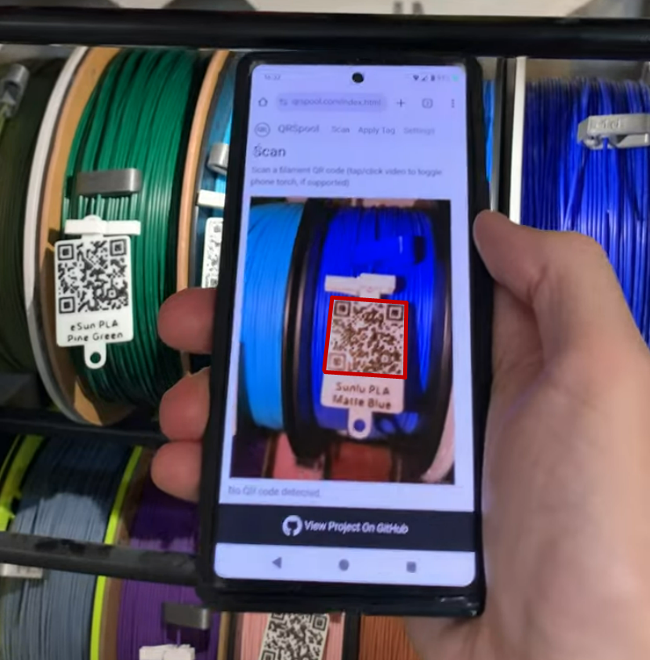
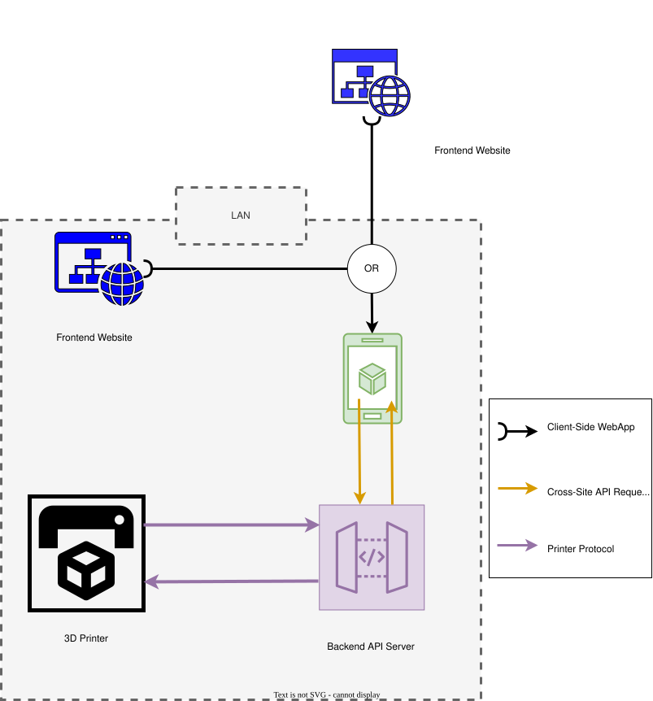

<div align="center">

# QRSpool


</div>

Update your 3D printer's filament slot settings by scanning a printed QR code or NFC tag with your phone. Point your camera at a filament code, then a slot code, and the printer updates its AMS settings instantly. 

> **Beta:** Fully functional for Bambu Labs printers on pre-January-2025 firmware, using the well-established [bambulabs-api](https://pypi.org/project/bambulabs-api/) library. Printers on newer firmwares with LAN+DEV mode are supported by an **experimental** custom communication library that is off by default and must be enabled per printer — see [Choosing a backend](#choosing-a-backend). Please report any issues you encounter.

**Super Experimental:** Now includes initial support for cloud-connected printers (**not** on LAN+DEV mode) on the latest firmwares, but only over local LAN communication (server still has to be on the same local network). This requires you to obtain and provide appropriate certificates and keys for signing printer commands, which is non-trivial. Most users should stick with LAN+DEV mode, but full details are in the [Configuration](#configuration) section.

## Table of Contents
- [What It Does](#what-it-does)
- [Requirements](#requirements)
- [Quick Start](#quick-start)
  - [Step 1: Set Up the Backend Server](#step-1-set-up-the-backend-server)
  - [Step 2: Connect the Frontend](#step-2-connect-the-frontend)
- [Configuration](#configuration)
  - [Top-level settings](#top-level-settings)
  - [Per-printer settings](#per-printer-settings)
  - [Choosing a backend](#choosing-a-backend)
  - [Command signing](#command-signing-highly-experimental)
- [Scanning and Applying Filament](#scanning-and-applying-filament)
- [Creating Tags](#creating-tags)
  - [Filament QR Codes](#filament-qr-codes)
  - [Slot QR Codes](#slot-qr-codes)
  - [Printing Your Tags](#printing-your-tags)
  - [Attaching Tags to Spools](#attaching-tags-to-spools)
  - [NFC Tags](#nfc-tags)
- [Bambu Printer Notes](#bambu-printer-notes)
- [Technical Reference](#technical-reference)
  - [URL Parameters](#url-parameters)
  - [OpenTag3D Field Length Limits](#opentag3d-field-length-limits)
  - [Backend Server API](#backend-server-api)
  - [Backend Server Authentication](#backend-server-authentication)
  - [3rd Party Dependencies](#3rd-party-dependencies)

---

## What It Does

QRSpool has two components:

- **Frontend**: A website ([qrspool.com](https://qrspool.com)) that uses your phone's camera or NFC to scan filament tags. All image processing happens locally in your browser; no camera data is ever sent to any server.
- **Backend server**: A small server you run on your home network that bridges the website and your printer(s).

The typical workflow:

1. 3D print some QR codes or write some NFC tags* and attach them to your filament spools and AMS slots
2. Scan the QR code (or tap an NFC tag) on a filament spool with your phone camera, right from your browser
3. Scan the QR code (or tap an NFC tag) on the slot you want the filament settings applied to
4. View and verify your printer's new AMS slot setting right from your phone

*If you have an Android phone with Chrome, you can use standardized NFC tags instead of QR codes. For everyone else, custom web URL NFC tags can be used and provide similar functionality, but may require extra confirmation steps each time you scan a tag. See the [NFC Tags](#nfc-tags) section for info about supported formats and how to write tags.

You can also scan just a filament code/tag and then manually select a slot to apply it to on your phone. 

Click below for a quick demo video of the QR scanning process in action:

<a href="https://www.youtube.com/shorts/bS265bDV_I8"></a>

---

## Requirements

- **Printer:** A Bambu Labs printer in LAN-only mode, or LAN+DEV mode for newer printers/firmware (other printer brands not currently supported)
- **Server:** An always-on computer (server) on the same network as your printer, able to run either Docker (recommended) or Python ≥3.10
  - Will work best if it has a stable local IP address or DNS name
  - Needs internet access when first installing dependencies, and `git` on PATH if you install natively rather than with Docker
- **Phone:** Any modern smartphone with a camera
  - Chrome is recommended; Firefox and Safari support the core scanning features with some limitations

---

## Quick Start

### Step 1: Set Up the Backend Server

The backend server translates data between the website and your printer. It runs on a computer on your home network.

```bash
git clone https://github.com/Aptimex/QRSpool.git
cd QRSpool/bambu-server
cp configs/bambu_config.example.json configs/bambu_config.json
```

Now edit `configs/bambu_config.json` and fill in your printer's IP address, serial number, and access code, and set a username and password for the server. Multiple printers can be configured in that file; just ensure each printer entry in that file receives a unique name. The defaults suit a LAN-only printer; see [Configuration](#configuration) for the full list of settings, including what to change for a printer in LAN+DEV mode.

**Run it with Docker (recommended):**

```bash
sudo docker compose up --build -d
```

This starts the server on port 5123 using HTTP only. Configuration files are mounted live from the `configs/` folder and persist across container restarts. If you ever change a config, just run `sudo docker compose restart` to reload them. 

> [!NOTE]
> The build installs two of its dependencies from GitHub rather than PyPI (see [3rd Party Dependencies](#3rd-party-dependencies)), so the machine needs internet access the first time you build. Docker caches that step, so a later `--build` will *not* pick up new versions of those two libraries — use `sudo docker compose build --no-cache` when you want to update them.

<details>
<summary>Running natively without Docker</summary>

You'll need **git** installed as well as Python, because two of the requirements install from GitHub rather than PyPI (see [3rd Party Dependencies](#3rd-party-dependencies)). Using a virtual environment is recommended, and required on distributions that mark the system Python as externally managed.

```bash
cd bambu-server/
python3 -m venv .venv
source .venv/bin/activate          # Windows: .venv\Scripts\activate
python3 -m pip install -r requirements.txt
openssl req -new -x509 -keyout key.pem -out server.pem -days 3650 -nodes
flask run --host=0.0.0.0 --port=5123
```

To pick up later changes to those two libraries, re-run the install with `--upgrade`:

```bash
python3 -m pip install --upgrade --force-reinstall -r requirements.txt
```
</details>

> [!WARNING]
> The frontend and backend must both use HTTP or both use HTTPS. Mixing protocols will cause the browser to silently refuse communication.

> [!WARNING]
> HTTP-only mode should only be used for testing out the project, unless you fully trust the security of your local network. Any device on your network can passively sniff your server credentials in every request when you use HTTP instead of HTTPS. 

**HTTPS certificate options** (uncomment the appropriate `CMD` line in the Dockerfile):
- **HTTP only** *(lowest friction to get started)*: No certificate needed. Use with `http://qrspool.com` (no `s` before the `:`) for the frontend. Upgrade to one of the HTTPS options below once you've decided you want to keep using this project. Remember, HTTP exposes your credentials to anyone on the local network.
- **Real certificate via reverse proxy** *(recommended for continued use)*: Use a tool like [Caddy](https://caddyserver.com/) to add proper TLS. A free [DuckDNS](https://www.duckdns.org/) subdomain gets you a real domain name to attach a certificate to. Step-by-step instructions for this kind of setup are [included in the repo here.](bambu-server/HTTPS.md)
- **Self-signed cert** *(only use for dev work)*: Works immediately, but requires a browser exception confirmation on every browser restart, which is really annoying. Usable for development work, not recommend for long-term use. 

### Step 2: Connect the Frontend

The frontend is already hosted at [qrspool.com](https://qrspool.com) (available over both HTTP and HTTPS) so you don't need to do any setup for that part on your end!

1. Open **https://qrspool.com/settings.html** on your phone in Chrome (use **http://qrspool.com/settings.html** if your backend is HTTP-only)
2. Enter your backend server's URL (e.g. `https://192.168.1.100:5123`), username, and password
3. Tap **Save**, then **Validate** to confirm the connection works

> [!IMPORTANT]
> If your server uses a self-signed certificate, you'll need to open the server URL directly in your browser and accept the security warning. You may need to do this again each time your browser restarts. Using a real certificate with Caddy as described above avoids this nuisance entirely.

Go to the **Scan** tab and grant camera and/or NFC access as prompted. Now you're ready to go!

> [!TIP]
> Firefox and Safari also support QR scanning, but lack torch (flashlight) control, vibrate-on-scan, and NFC scanning. Chrome on Android is recommended for the full experience.

**Prefer to host the frontend yourself?** Serve the `client/` folder with any web server - for example, `python3 -m http.server` or the included `https-server.py` script. For fully offline use, download the Bootstrap and jsQR files referenced in each HTML file and update the references in the code to point to your local copies.

---

## Configuration

All server settings live in `bambu-server/configs/bambu_config.json`. Copy `bambu_config.example.json` to get started. With Docker the whole `configs/` folder is mounted live, so your settings survive rebuilds — run `sudo docker compose restart` after any change to reload it.

### Top-level settings

| Key | Required | Default | Purpose |
|---|---|---|---|
| `printers` | yes | — | List of printer entries (see below). Each needs a unique `name`. |
| `auth_user` / `auth_pass` | yes | — | Credentials the frontend uses to reach the server |
| `inactivity_timeout` | no | `300` | Seconds of inactivity before the server drops its printer connection. `0` disables it. |
| `key_pem_file`<br>`cert_chain_pem_file`<br>`crl_pem_file` | only for signing | — | Paths to signing credentials, relative to `bambu-server/`. See [Command signing](#command-signing-highly-experimental). |

### Per-printer settings

| Key | Required | Default | Purpose |
|---|---|---|---|
| `name` | recommended | the printer's IP | Display name; must be unique across printers |
| `ip` | yes | — | Printer's local IP address |
| `serial` | yes | — | Printer serial number |
| `access_code` | yes | — | Access code from the printer's display (Settings > LAN Only) |
| `enable_custom_libraries` | no | `false` | Selects which backend talks to this printer (see below) |

#### Experimental settings

These apply only when `enable_custom_libraries` is `true`, and are ignored otherwise.

| Key | Required | Default | Purpose |
|---|---|---|---|
| `enable_signing` | no | `false` | Sign commands sent to this printer. See [Command signing](#command-signing-highly-experimental). |
| `model_id` | no | auto-detected | Printer model id, e.g. `N2S` for an A1 — see the table below |
| `firmware_version` | no | auto-detected | e.g. `01.05.00.00`. Check Settings > Device > Firmware on the printer. |

If you leave `model_id` or `firmware_version` out, the server asks the printer at connect time and logs what it found. Setting them explicitly skips that check and makes the initial connection faster and more reliable. If detection fails the server says so and names the two fields to set.

Here's a list of valid `model_id` values associated with each printer name.  

| Printer | Model ID | | Printer | Model ID |
|---|---|---|---|---|
| X1 Carbon | BL-P001 | | A1 | N2S |
| X1 | BL-P002 | | A2L | N9 |
| X1E | C13 | | H2C | O1C |
| X2D | N6 | | H2C | O1C2 |
| P1P | C11 | | H2D | O1D |
| P1S | C12 | | H2D Pro | O1E |
| P2S | N7 | | H2S | O1S |
| A1 mini | N1 | | | |

For convenience, supplying one these exact printer names instead of an ID is also supported. The H2C is the one exception: it ships as two model IDs with different capabilities, so the name `H2C` is rejected as ambiguous. Use `O1C` or `O1C2` — or leave `model_id` out entirely and let the server detect which one your printer is. Note that name and ID values are both are matched case-insensitively.

This table is maintained in the [bambu-mqtt-generator](https://github.com/Aptimex/bambu-mqtt-generator) library, which is where these IDs come from; check there for possible updates if a newer printer is missing here.

### Choosing a backend

Each connected printer is handled by one of two communication backends, defined by the value of its `enable_custom_libraries` key in your config:

- **`false`** *(default)* — uses [bambulabs-api](https://pypi.org/project/bambulabs-api/), a mature third-party library. This is the well-tested path and the right choice for any printer it supports, which is most printers on pre-Jan-2025 firmware running in LAN-only mode.
- **`true`** — uses my custom [bambu-mqtt-comms](https://github.com/Aptimex/bambu-mqtt-comms) and [bambu-mqtt-generator](https://github.com/Aptimex/bambu-mqtt-generator) libraries that I developed specifically for this project. These make printers on newer firmwares with LAN+DEV mode work, and provides the support for signing commands to enable interoperability and control over cloud-connected printers too (when Developer mode is off). These libraries will (theoretically) take into account the capabilities and expected data formats for every different printer+firmware combination when generating and sending messages; that's why they require the printer model and firmware version.

> [!WARNING]
> The custom-library backend is **very experimental**. It speaks an undocumented protocol reconstructed from the Bambu Studio source and limited traffic analysis, it has only been tested on a small number of printers, and Bambu can change the protocol in any firmware update without notice. Only enable it for printers that the default `bambulabs-api` backend can't handle: if your printer runs an older LAN-only firmware (no Developer mode option), then leave this off, it won't provide any benefit and might not work at all.

The two backends can be mixed freely on different printers: set the flag per printer, and each connects its own way.

### Command signing *(highly experimental)*

> [!CAUTION]
> Support for cloud-connected printers via command signing is the least-tested part of this project. It requires key material you must obtain yourself, it depends on protocol details that firmware updates may change, and it is off by default. Proceed at your own risk.

<details>
<summary>Here be dragons (click to proceed)</summary>

Bambu firmware released after roughly January 2025 (after the rollout of their "Authorization Control" changes) rejects unsigned state-changing commands. Reading slot data still works, but writes silently fail. Signing solves that, but requires getting access to certs and keys that Bambu does not publish.

**You need three PEM files:**

| File | Contents |
|---|---|
| `key.pem` | The private key that signs each command |
| `chain.pem` | The full certificate chain: leaf + intermediate + root. The leaf is extracted from it automatically, so it isn't configured separately. |
| `crl.pem` | Any signed certificate revocation list. Expired ones work fine. |

The contents of all these files must come from Bambu, there is currently no way to generate and use your own.

The `key` is normally the hardest thing to get, but currently can be easily obtained using the Linux code in [this project](https://github.com/danielwoz/BambuSlicerKeySaver).

The associated Linux `chain` and `crl` contents can currently be obtained by visiting the API URL [mentioned here](https://bambuzled.github.io/posts/bambu-auth-control/#the-current-cert-api) and parsing the JSON response.

**None of these files are included with this project, and requests for them will be ignored.**

**Setup:**

1. Put the three files in `bambu-server/configs/signing/`. That folder already exists and gets mounted into the container.
2. Point the top-level config keys at them:

   ```json
   "key_pem_file": "configs/signing/key.pem",
   "cert_chain_pem_file": "configs/signing/chain.pem",
   "crl_pem_file": "configs/signing/crl.pem",
   ```

   All three are required together to enable signing — the server refuses to start if only some are set.
3. Set both flags on each printer that needs signing:

   ```json
   {
     "name": "My P2S",
     "ip": "192.168.1.100",
     "serial": "0123456789ABCDE",
     "access_code": "87654321",
     "enable_custom_libraries": true,
     "enable_signing": true
   }
   ```

On connect the server registers your certificate with the printer and waits until the printer confirms it trusts it, then signs each command it sends. Registration is lost whenever the printer power-cycles (and for some printers, when a different application connects to it), so this registration repeats on every connection. 

If the credentials are missing or the printer never trusts the certificate, the server logs a warning and falls back to sending unsigned commands rather than failing outright. On firmware that requires signatures those writes will be rejected, and the rejection is reported back to the frontend.

I welcome bug reports related to this experimental signing functionality, but won't provide any support for the process of obtaining the required files.

</details>

---

## Scanning and Applying Filament

From the **Scan** tab, point your camera at a filament or slot QR code until you get a scan confirmation. Once you have scanned a pair, the scanned filament will be automatically applied to the scanned slot in the active printer. Alternatively, you can scan just a filament tag and then use the Apply page to manually select a slot to apply it to. 

Scanning both tag types in either order causes the filament to be applied to the slot automatically. If you'd prefer to confirm before applying, there's a setting for that on the Settings page.

If you have multiple printers configured, you can manually change the active printer using the dropdown at the top of the page, or include the printer name in the slot QR code to link it to a specific printer. 

> [!TIP]
> Check out the Settings tab to customize various scan behavior options to best suit your prefered workflow. 

---

## Creating Tags

### Filament QR Codes

Filament tags use a compact pipe-delimited format derived from [OpenSpool 1.0](https://openspool.io/rfid.html):

```
OS1.0|TYPE|COLOR_HEX|BRAND|MIN_TEMP|MAX_TEMP
```

Example:
```
OS1.0|PLA Matte|FF5733|Bambu|190|230
```

Fields are parsed left to right. You can omit fields from the right end, or leave individual fields empty if you don't need them. `OS1.0` is the format identifier the scanner uses to recognize compatible codes.

> [!NOTE]
> For Bambu printers, `TYPE` and `BRAND` must exactly match a profile name from the Bambu Studio filament dropdown. See [Bambu Printer Notes](#bambu-printer-notes) for details.

### Slot QR Codes

Slot tags identify a specific printer and/or AMS slot:

```
SLOT|IDS|PRINTER_NAME
```

Both `IDS` and `PRINTER_NAME` are optional, but at least one must be present for the tag to have any effect.

Full tag (switch active printer and then target a slot):
```
SLOT|{"amsID":0,"slotID":0}|My Printer
```

Slot only (applies to the current active printer):
```
SLOT|{"amsID":0,"slotID":0}|
```
- Optionally drop the final `|`

Just switch active printer:
```
SLOT||My Printer
```

The printer name must be the same value that you configured in the `bambu_config.json` file.

To find the correct `ids` value for a slot, open the Apply page and expand the "↓ Show/Hide All Slot Info ↓" section under any slot. Then just tap/click the value to copy it. 

> [!WARNING]
> Slot IDs are assigned by the printer itself and can change with firmware updates or AMS hardware changes (such as adding or removing a daisy-chained unit). Double-check that all your codes/tags still reference the expected slots after changes to any of those configurations. 

If you have multiple printers configured, only one printer is "active" at a time, and switching printers takes a few seconds. For the fastest workflow, scan the filament tag first, then the slot tag.

### Printing Your Tags

[QR2STL](https://qrcode2stl.printer.tools/) generates printable 3D QR codes. A self-hostable fork (with ads and wait times removed) is also [available here](https://github.com/Aptimex/qrcode2stl). Additionally, [here's a JSON file](qr2stl.json) with good starting values that you can import into the site. Use the "Import/Export Settings" button at the top-right of the webpage to do so. 

Tips for reliable scanning:
- **30×30mm** with a 0.4mm nozzle works well; smaller dimensions need a 0.2mm nozzle
- Use the **Arachne** wall generation method
- Use the lowest error correction level, or else increase the tag size to compensate for a denser code

### Attaching Tags to Spools

A custom clip with multiple attachment options for filament spools [is available for free on MakerWorld](https://makerworld.com/en/models/1408538-filament-clip-for-qrspool-tags). It's designed for QR2STL models with a 5mm keychain hole. Use the JSON mentioned above to quickly generated a compatible model. 

> [!WARNING]
> Don't try to leave this clip on the filament when you put the spool in your AMS, they are not designed for that and will likely cause issues. However, if you are using an AMS Lite, on most spools they can be left clipped onto the outside edge of the spool. 

### NFC Tags

**On Android with Chrome**, the Scan and Apply pages show a button to enable NFC scanning. Once enabled, tapping an NFC tag works just like scanning a QR code with the camera.

> [!IMPORTANT]
> The Web NFC API only works when the website is using HTTPS, or is running on `localhost`. So you must also be using HTTPS (self-signed cert works) on your backend server to make use of this feature when using QRSpool.com.

QRSpool currently supports several different NFC formats:
- Tags containing the same plain text string as a QR code
- [OpenSpool](https://openspool.io/rfid.html#protocol) tags
- [OpenTag3D](https://opentag3d.info/spec) tags; but see [OpenTag3D Field Length Limits](#opentag3d-field-length-limits) for important notes if you're using OpenTag3D with a Bambu printer

To write tags, use a general-purpose NFC app like [NFC Tools](https://play.google.com/store/apps/details?id=com.wakdev.wdnfc) or [NFC TagWriter](https://play.google.com/store/apps/details?id=com.nxp.nfc.tagwriter). If yout want to use OpenTag34, you can instead use the [OpenTag3D Make tab](https://opentag3d.info/make), which may be easier. Native tag-writing functionality similar to that site will be added to QRSpool.com at some point in the future. 

**On iOS (and any phone without in-browser NFC):** Use URL-based NFC tags. [NFC Tools](https://apps.apple.com/us/app/nfc-tools/id1252962749) and [NFC TagWriter](https://apps.apple.com/us/app/nfc-tagwriter-by-nxp/id1246143221) are also available in iOS for this purpose. A tag containing a URL like this will open the site with filament data pre-loaded when tapped, and does not require you to already have the website/browser open.

Example filament tag string:
```
https://qrspool.com?qrstring=OS1.0|PLA|FF5733|Bambu|190|230
```

Example slot tag string:
```
https://qrspool.com?&slotstring=SLOT|{"amsID":0,"slotID":1}|My Printer
```

You can even combine filament and slot data in a single URL to auto-apply on tap, if you have a need to do so:

```
https://qrspool.com?qrstring=OS1.0|PLA|FF5733|Bambu|190|230&slotstring=SLOT|{"amsID":0,"slotID":1}
```

> [!TIP]
> NFC tags support multiple NDEF records. You can set the first record to a URL (for native smartphone handling) and the second to a plain-text QR string, or one of the other supported formats. Most native phone scans will only process the first record (the URL), while QRSpool.com will parse all records (recognizing the second record), giving you maximum compatibility with both approaches across all phones in one tag.

See also the [URL Parameters](#url-parameters) section for additional supported URL formats available for power users. 

---

## Bambu Printer Notes

**Filament code matching:** `BRAND` and `TYPE` in a tag must match a profile name from Bambu Studio exactly (e.g. `Bambu` + `PLA Matte`). The server combines them and looks up the internal code (`GFA01` in this example) in the `bambu-ams-codes.json` file.

If an exact match fails, the server tries these fallbacks in order:
1. Replace the brand with `Generic` and search again
2. Treat the `TYPE` field directly as a filament code
3. If `BRAND` is `RAWCODE`, assumes `TYPE` contains the exact internal code (like `GFA01`; also useful for [custom AMS profiles](https://forum.bambulab.com/t/how-to-add-custom-filaments-so-you-can-select-them-in-the-ams/52140))

If all fallbacks fail, the server returns an error. 

> [!NOTE]
> In testing, unrecognized/invalid raw codes were silently ignored by the printer and never caused any problems. 

**Temperature fields** are generally ignored by Bambu printers; the profile defaults are used instead. You can safely omit `MIN_TEMP` and `MAX_TEMP` from your tags, but it may be worth keeping them in case that ever changes. 

**Empty slot limitation:** Currently-empty slots can't have their filament settings changed. Make sure filemant is loaded before trying to apply a tag to the slot. 

**Cloud-connected printers:** Slot data can be read, but applying filament changes will silently fail. LAN-only mode (LAN+DEV on newer printers/firmware) is required for writes.

**Tested LAN-Only hardware:** A1 (firmware 01.04.00.00) with AMS Lite (firmware 00.00.07.94). Should work with any printer and AMS supported by [bambulabs-api](https://pypi.org/project/bambulabs-api/). This is the default backend and the recommended one wherever it works.

**Experimental LAN+DEV support:** Enabled per printer via `enable_custom_libraries` (see [Choosing a backend](#choosing-a-backend)). Tested on an A1 (firmware 01.05.00.00, AMS Lite) and a P2S (firmware 01.02.00.00, AMS 2 Pro), covering both external-spool reporting formats. Everything about it is reconstructed from the Bambu Studio source and traffic analysis rather than documentation, so treat it as experimental on any printer — and expect firmware updates to be able to break it. If you know of an existing Python library with better-tested support for newer printers and firmwares, let me know.

**Command signing:** Firmware from roughly January 2025 onward rejects unsigned writes for cloud-connected printers. Signing is supported but off by default and needs credentials you must supply yourself; see [Command signing](#command-signing-highly-experimental).

---

## Technical Reference

This section covers implementation details for developers who want to build compatible servers or clients.

QRSpool's frontend and backend are intentionally decoupled: the frontend handles all QR/NFC parsing and generates standard REST requests to the backend; the backend translates those REST requests into whatever protocol a given printer needs. A backend server for a different printer brand could be built without changing the frontend at all (in theory).



### URL Parameters

The scan page accepts pre-loaded data via URL parameters, checked in this order:

| Parameter | Format |
|---|---|
| `?qrstring=X` | Same string as a filament QR code |
| `?osjson=X` | OpenSpool JSON string (no line breaks) |
| `?type=A&color_hex=B&brand=C&min_temp=D&max_temp=E` | Individual OpenSpool fields (`type` key required) |
| `?slotstring=X` | Same string as a slot QR code, including the `SLOT` prefix |

### OpenTag3D Field Length Limits

OpenTag3D limits the Material Name and Modifier fields to 5 characters, which many Bambu filament names exceed. Options when a value doesn't fit:

1. **Truncate to 5 characters**: works if only one possible expansion exists; the server returns an error if the truncation could correspond to more than one known value
2. **Use a recognized abbreviation**: e.g. `Supp` → `Support`, `HiSpd` → `High Speed`, `Tgh+` → `Tough+`; see `bambu-server/configs/type-abbreviations.json` and `modifier-abbreviations.json` for the full list. You can add your own abbreviations to this file too
3. **Use the Color Name field**: put the full Manufacturer and Type there first and leave the dedicated fields blank; the server will attempt to match it
4. **Use RAWCODE**: set Name to `RAWCODE` and put the code from `bambu-ams-codes.json` in the Type field

### Backend Server API

Data in `<>` should be replaced with appropriate values; everything else is a literal string.

#### GET /serverStatus *(unauthenticated)*

Returns server status and authentication information. This is the endpoint hit when the user validates their server settings.

```json
{
    "status": "running",
    "authRequired": "<true|false>",
    "authCorrect": "<true|false>",
    "serverVersion": "<SemVer version string>"
}
```
- `authRequired`: whether other endpoints enforce Basic Auth. 
- `authCorrect`: whether the credentials in this request (optional here) are valid.
- `serverVersion`: allows the frontend to detect when the backend is outdated and alert the user, without requiring any network-based update checks. 

#### GET /printerStatus

On success:
```json
{
    "status": "<statusMessage>"
}
```

If an error is encountered, optionally retun an error field instead:
```json
{
    "error": "<errorMessage>"
}
```

#### GET /slots

Returns available filament slots. `ids` and `displayID` are mandatory per slot; all others are optional, but you need to return enough other data fields to be useful to the user.

```json
{
    "slots": [
        {
            "ids": { "<OPAQUE>": "<OPAQUE>" },
            "displayID": "<value>",
            "<dk1>": "<value>",
            "<dk2>": "<value>",
            "<otherKey>": "<value>"
        }
    ],
    "displayKeys": ["<dk1>", "<dk2>"],
    "colorHexKeys": ["<dk2>"]
}
```

- `ids`: opaque object uniquely identifying the slot; the frontend copies it into `/setFilament` requests unchanged
- `displayID`: human-readable slot identifier; should correspond to physical numbering or markings on the hardware if they exist
- `displayKeys`: important slot fields to display by default in the slot selection UI
- `colorHexKeys`: fields whose values are 6-digit hex color codes and should be rendered as colors in the UI

#### POST /setFilament

```json
{
    "ids": { "OPAQUE": "OPAQUE" },
    "type": "<value>",
    "colorHex": "<value>",
    "brand": "<value>",
    "minTemp": "<value>",
    "maxTemp": "<value>"
}
```

Field values may be empty strings if data was omitted from the scanned tag. The server must silently ignore unknown keys, and may support more than these. Currently recommended optional fields for maximum compatibility:

```json
{
    "colorName": "<value>",
    "bedTemp": "<value>"
}
```

#### GET /reconnect

Tells the server to disconnect and reconnect to the printer. No parameters. Intended as a quick-fix when things aren't working as expected.

#### GET /printers

Returns the list of configured printer names. Used by the frontend to populate the printer selector dropdown.

```json
["My Printer", "Workshop Printer"]
```

#### GET /activePrinter

Returns the name of the currently active printer.

```json
{
    "name": "My Printer"
}
```

#### POST /activePrinter

Switches the active printer. Server will tear down the connection to the current printer and establishes a new connection to the target printer.

```json
// Request
{ "name": "Workshop Printer" }

// Response
{ "name": "Workshop Printer" }
```

If the requested printer name is not recognized, the server returns an error with the list of known printers (lookup is case-insensitive):

```json
{
    "error": "Unknown printer 'SomePrinter'. Known printers: ['My Printer', 'Workshop Printer']"
}
```

### Backend Server Authentication

The server uses standard [HTTP Basic Authentication](https://en.wikipedia.org/wiki/Basic_access_authentication). All endpoints except `/serverStatus` require:

```
Authorization: Basic <base64(username:password)>
```

Credentials and settings are stored in the browser's `localStorage`, not cookies, to avoid incidental exposure to the frontend's website server.

The server does not rate-limit bad authentication requests, so is potentially vulnerable to brute-force authentication attacks. Use a strong password and don't expose the server to the Internet.

### 3rd Party Dependencies

- [jsQR](https://github.com/cozmo/jsQR): QR code decoding from the camera feed (frontend)
- [Bootstrap](https://getbootstrap.com/): UI framework (frontend)
- [bambulabs-api](https://pypi.org/project/bambulabs-api/) ≥2.6.2: Bambu printer communication (backend) for LAN-only printers — the default backend
- [bambu-mqtt-comms](https://github.com/Aptimex/bambu-mqtt-comms) + [bambu-mqtt-generator](https://github.com/Aptimex/bambu-mqtt-generator): MQTT connection handling, payload generation and signing (backend) for printers using the experimental `enable_custom_libraries` mode. **Not published to PyPI** — `requirements.txt` installs them directly from GitHub, so pip needs `git` available. Both are installed regardless of whether any printer enables that mode.
- [paho-mqtt](https://pypi.org/project/paho-mqtt/) and [cryptography](https://pypi.org/project/cryptography/): underlying MQTT transport and signing primitives, pulled in automatically by those two
